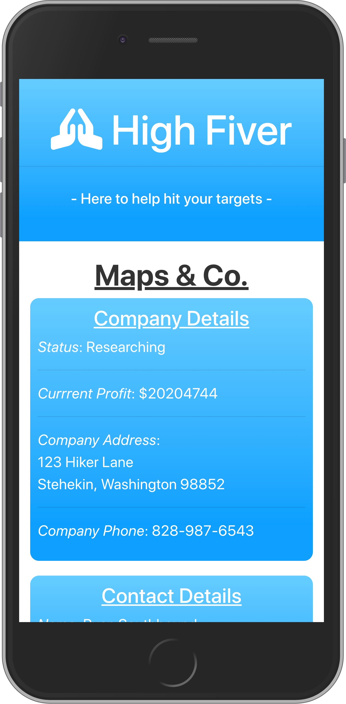
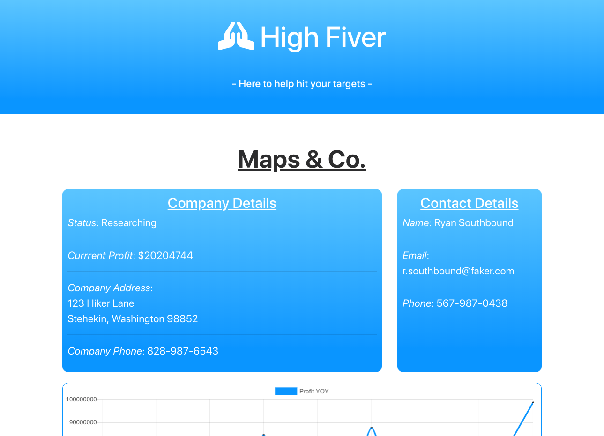
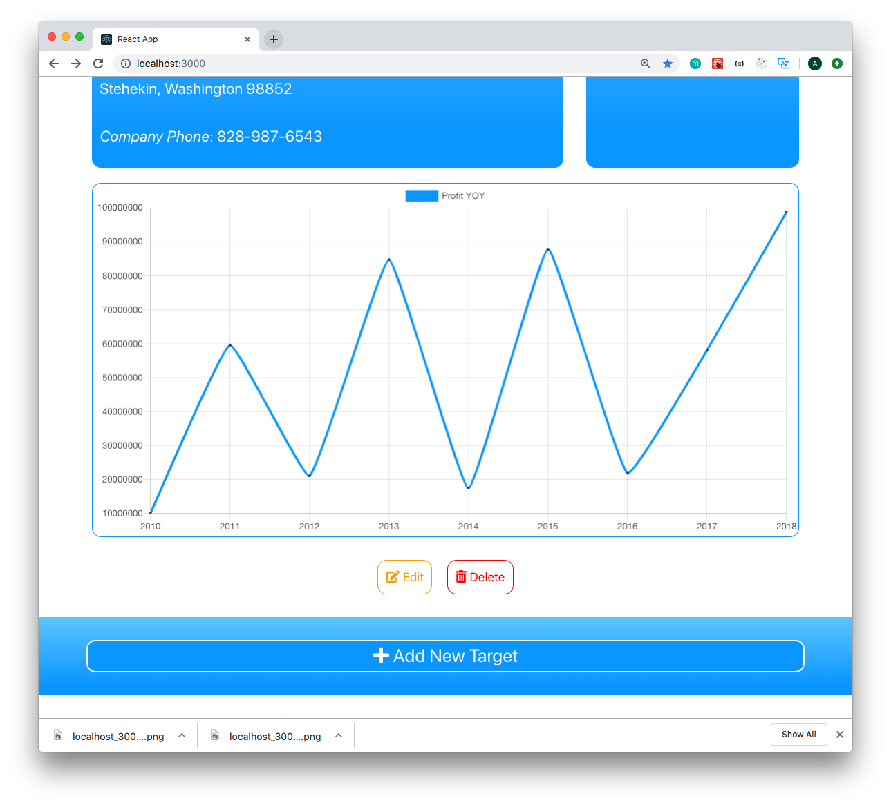
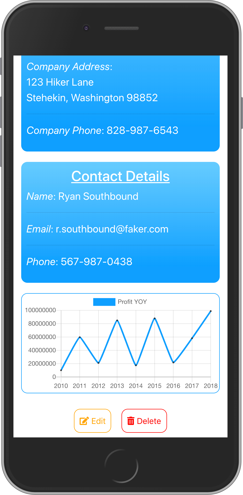
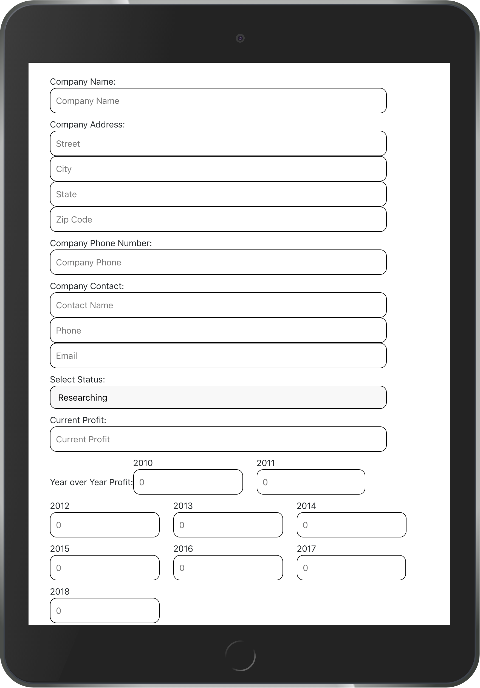
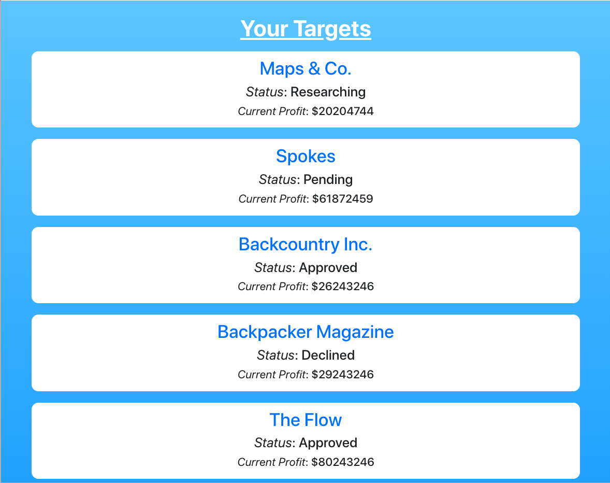
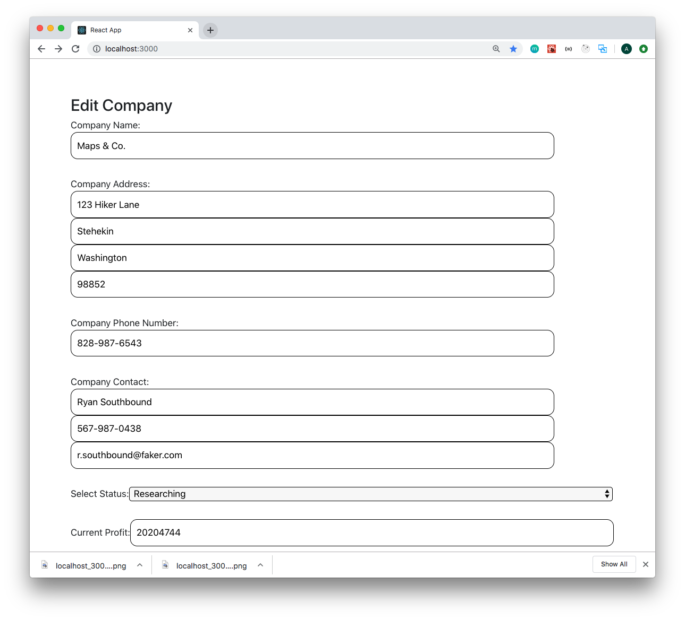

# High Fiver

    </img>

# [Live Demo](url_goes_here)

## The Mission:
  High Fiver is a CRUD application to help assist companies with tracking and anlyzing potential target comppanies. The challenge was to develop a protoype that would allow the client to perform the following activities:
  - View a list of targets
  - Edit and existing target
  - Create a new target
  - Delete a target
  
  The goal was to use a moder JavaScript framework, use mock data and capture status, company info, company contacts, and financial performance. 
  
 

## Built with:

* React
* JavaScript
* Chart.js
* Font Awesome for icons
* Google Fonts
 

    </img>&nbsp;</img>

 

## Minimum Viable Product:
  - Display all targets
  - View a single target in detail
  - Add a new target
  - Edit an existing target
  - Delete a target

## Secondary Goals Accomplished
  - Use Chart.js to display financial data
  - Add styling and media queries for mobile and ipad displays
  
  
## Future additions
  Given the limit of time, these are some functionalities I would like to add in the future.
  - Search bar to find and filter specific companies
  - Sorting ability by status
  - Form validation
  - an overall better UI/UX
  - Hook up to a database
  - User login
  - Routing
  - Refactoring
 

    </img>&nbsp;</img></img>&nbsp;</img>

 

## Obstacles 
-SO MANY - But here's one example for now.
*Obstacle -*
    I haven't worked this thoroughly with React in a little, and I kept getting stuck on refactoring the Form component. I still need to do the same for the Edit form. For the life of me, I could not think of a great way to capture all the data cleanly. I went down a rabbit hole of refactoring the form, before I realized I was losing time in the details and still needed to work on other functionalities. The code is still not very DRY and could use a bit of work - but I am proud of what I accomplished in just a few days! There is always more to do though, and I look forward to coming back and working on the future additions. 
    

    </img>

